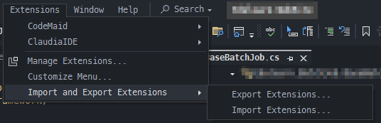
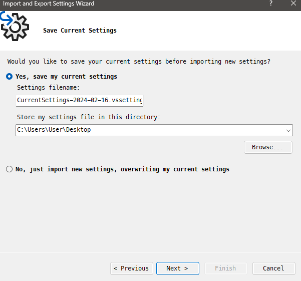
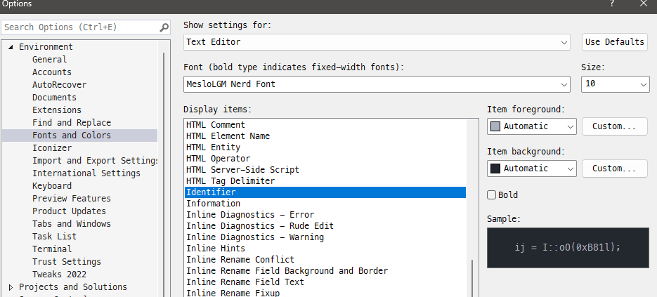
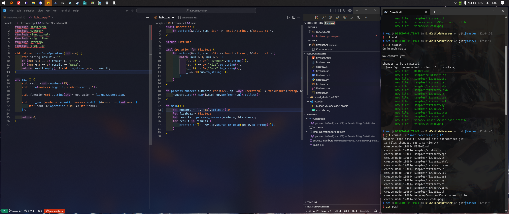
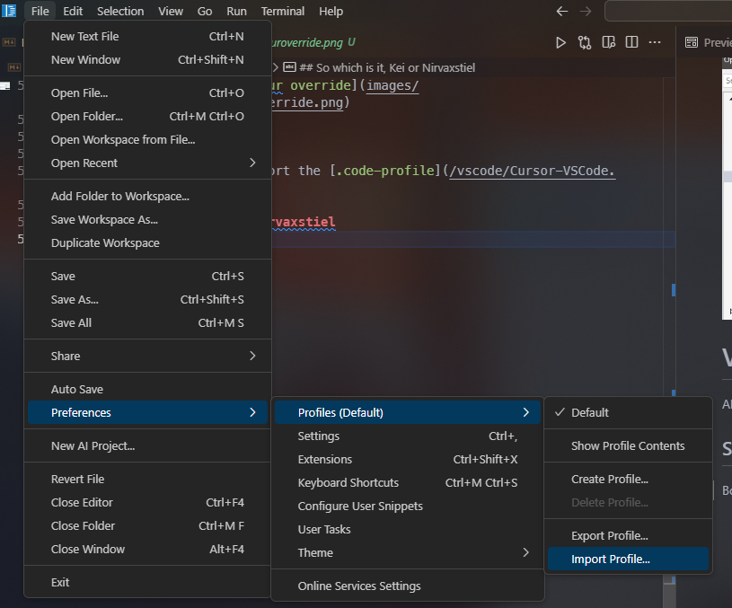

# Table of Contents
- [Table of Contents](#table-of-contents)
- [KeiCodeDresser: Visual Studio \& VS-Code Theme \& Configurations.](#keicodedresser-visual-studio--vs-code-theme--configurations)
- [Prerequisites](#prerequisites)
- [Other forewords](#other-forewords)
  - [Keyboard Shortcuts](#keyboard-shortcuts)
    - [Visual Studio Code](#visual-studio-code)
    - [Visual Studio 2022](#visual-studio-2022)
- [Visual Studio (2022)](#visual-studio-2022-1)
    - [Setting up for Visual Studio](#setting-up-for-visual-studio)
    - [Why do some of my methods appear `RED` instead of what the screenshots show?](#why-do-some-of-my-methods-appear-red-instead-of-what-the-screenshots-show)
- [Visual Studio Code/Cursor](#visual-studio-codecursor)
  - [Setting up](#setting-up)


# KeiCodeDresser: Visual Studio & VS-Code Theme & Configurations.

This repository contains a collection of extensions and my personal customized theme I've found useful or created to enhance my coding experience. It's organized by development environment, so you can easily find configurations relevant to your needs.

The base theme profile is `one-darker-pro`, but I dislike the use of reds for parameters and keywords.

# Prerequisites
1. Nerd Fonts
   
   I use the following nerd font from [Oh-My-Posh](https://ohmyposh.dev/docs/installation/fonts)
   ```powershell
   # using omp
   oh-my-posh font install
   ```

   ```sh
   # using homebrew
   brew tap homebrew/cask-fonts # You only need to do this once!
   brew search nerd-font       # Search for font packages

   # EXAMPLE: Install the NF version of Fira Code
   brew install --cask font-fira-code-nerd-font
   ```
2. ([For Visual Studio section](#visual-studio-2022)) Extension Manager 2022 [Visual Studio Marketplace](https://marketplace.visualstudio.com/items?itemName=Loop8ack.ExtensionManager2022) | [Github](https://github.com/loop8ack/ExtensionPackTools)
      

# Other forewords
## Keyboard Shortcuts
```diff 
- You might want to reset the keybindings or not import the keybindings that are included in the settings files. These are what I remember, not the full extent of my terrorism towards your muscle memory.
```

### Visual Studio Code
- Delete Line (no cut): `shift` + `delete`
- Renaming symbols/variables: `f2`
### Visual Studio 2022
- Delete Line (no cut): `shift` + `delete`
- Renaming symbols/variables: `f2`
- Build current project `ctrl` + `b`
- Build entire solution project `ctrl` + `alt` + `b`
- Comment: `ctrl` + `/`
- Uncomment: `ctrl` + `shift` + `/`
- Peek Inline Definition: `ctrl` + `click`
- Open Explorer: `ctrl` + `;` <sub>#I actually don't remember if this was an explicit binding, but I know I do use it and it works.</sub>

# Visual Studio (2022)


### Setting up for Visual Studio
1. Fetch the extensions from the [Visual Studio Folder](/visual_studio/vs2022/extensions.vsext)
2. Find `Extensions`\ `Import and Export Extensions`\ `Import Extensions` and import the `.vsext`
   
3. Close/Restart your Visual Studio to finish installing the extensions.
4. Fetch the font colours, settings used from the [Visual Studio Folder](/visual_studio/vs2022/Exported-2024-02-16.vssettings)
5. Find `Tools`\ `Import and Export Settings`
   
   
6. Follow the import wizard and don't forget to back up your current settings.
   
7. Update your ClaudiaIDE to set your own wallpapers
   
**And, that's it!**

### Why do some of my methods appear `RED` instead of what the screenshots show?

This is due to Roslynator. It overwrites some colours, including methods and such to Red. You can override this under the `Tools`\ `Environment`\ `Fonts and Colours`\ `Identifier`. You can either keep it as is, or revert it to `Automatic` for both the foreground and the background. That should fix it.



# Visual Studio Code/Cursor


*<sub><center>The theme looks blue here because my desktop wallpaper is blue, and it is on a shuffle basis.</center></sub>*

## Setting up

All you need to do is to import the [.code-profile](/vscode/Cursor-VSCode.code-profile). This works on both VSCode and Cursor.




<details>
<summary>Afterwords</summary>

> *So which is it, Kei or Nirvaxstiel*

***Both***

> *You MONSTER, task bar on the top?!11!*

~~Efficient mouse movement~~ I'm too lazy to move my mouse that much.

> Ew, VS Code Side bar on the right?

It's only consistent to my Visual Studio. Also, if I could I would move the outline to the left, just like my CodeMaid Spade. I also tend to just keep the explorer pinned and minimised permanent, only ever needing the Outline to be present for easier navigation of the current file structure.
</details>